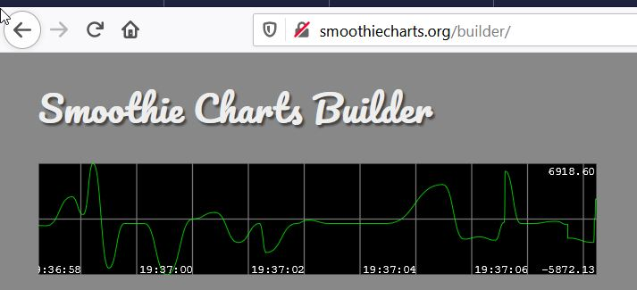

**smoothiecharts**  http://smoothiecharts.org/builder/  

**training katacoda.com** https://www.katacoda.com/

**changer le mot de password keycloak** 
http://localhost:8080/auth/realms/ecommerce/account/

En règle générale, pour déconnecter un utilisateur Keycloak, il faut passer par une URL qui ressemble à la suivante :
http://auth-server/auth/realms/{realm-name}/protocol/openid-connect/logout?redirect_uri=encodedRedirectUri
Tandis que pour la gestion de son compte, il faut passer par l’Url suivant :
http://auth-server/auth/realms/{realm-name}/account/

**Thorntail**
generator de projet commme spring initializer

